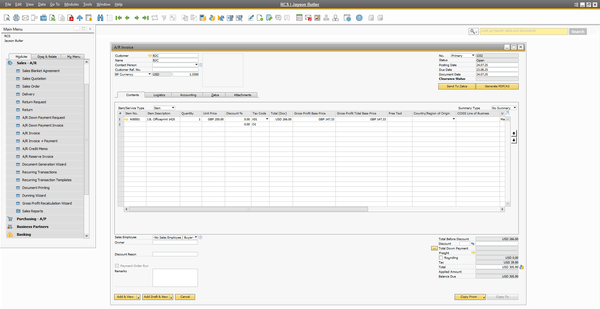
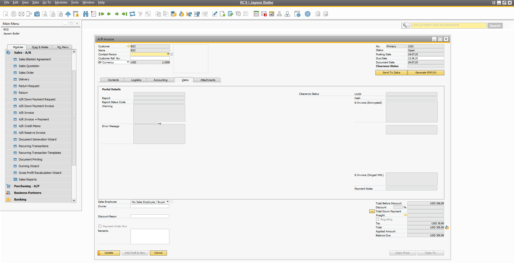
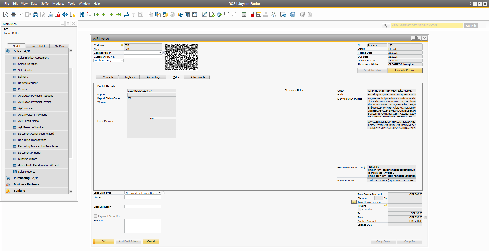
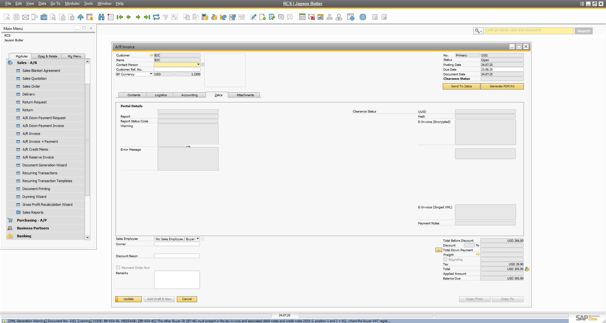
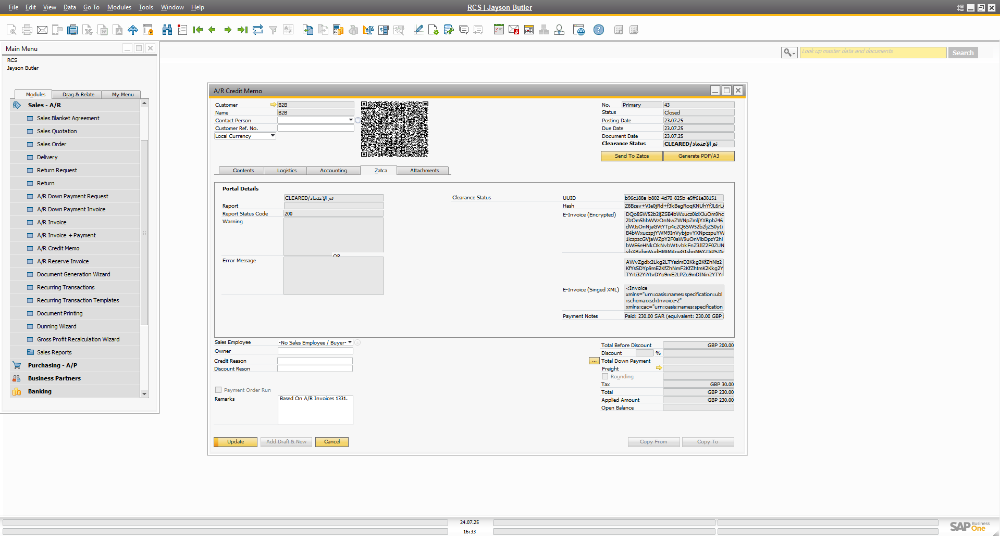
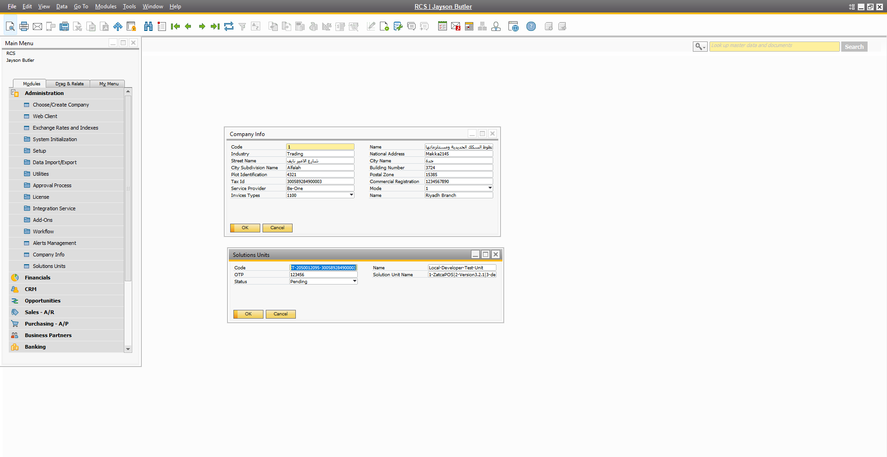

# ZATCA SAP Business One Integration

## Product Overview

**ZATCA SAP Business One Integration** is a ready-to-use add-on for SAP Business One that enables seamless compliance with the Saudi Zakat, Tax and Customs Authority (ZATCA) e-invoicing regulations. It automates the generation, validation, and submission of electronic invoices directly from SAP Business One, ensuring your business stays compliant and efficient.

## Key Features & Benefits

- **Full ZATCA Compliance**: Automatically generates e-invoices in the required XML format and submits them to ZATCA.
- **Real-Time Compliance Validation**: Every invoice is checked against ZATCA business rules before submission, ensuring only compliant invoices are processed.
- **Handles Foreign Currencies**: Supports invoices in foreign currencies, including automatic currency conversion and compliance with ZATCA requirements.
- **Seamless SAP Business One Integration**: Works natively within your existing SAP B1 environment—no need for external systems.
- **Automated Invoice Processing**: Reduces manual work, errors, and delays by automating the entire e-invoicing workflow.
- **Secure Digital Signatures**: Handles certificate management and digital signing as per ZATCA requirements.
- **Comprehensive Reporting**: Track invoice status, errors, and compliance from within SAP B1.
- **Quick Deployment**: Fast installation and configuration—get compliant in days, not weeks.

## Target Customers

- Companies using SAP Business One in Saudi Arabia.
- Businesses required to comply with ZATCA e-invoicing (FATOORA) regulations.
- Organizations seeking to automate and streamline their invoicing process.

## How It Works

1. **Invoice Creation**: User creates an invoice in SAP Business One as usual, including invoices in foreign currencies.
2. **Automatic ZATCA Compliance Check**: The add-on validates the invoice in real-time against all ZATCA business rules before submission, including correct handling of currency codes and conversion rates.
3. **Submission to ZATCA**: Compliant invoices are automatically submitted to ZATCA via secure API integration.
4. **Status Feedback**: The system updates the invoice status and provides feedback directly in SAP B1.

## Screenshots

### 1. Initial Invoice Creation

*Standard SAP Business One invoice entry screen before ZATCA compliance is applied.*

### 2. ZATCA Tab - Response Storage

*The ZATCA tab within the invoice form, where the ZATCA response is saved with QR code and clearance status.*

### 3. Successful Compliance Validation

*After real-time validation, the invoice is marked as ZATCA-compliant with generated QR code.*

### 4. Compliance Warning

*Compliance warning view showing detailed ZATCA status and guidance for corrective action.*

### 5. Credit Memo Compliance

*Credit memo document processed through the same automated ZATCA compliance workflow.*

### 6. Configuration Screen

*Configuration screen for API endpoints, certificates, and compliance parameters management.*

## Key Benefits

- **Stay Ahead of Compliance**: Avoid penalties and disruptions by automating ZATCA compliance.
- **Save Time & Reduce Errors**: Eliminate manual data entry and validation.
- **Integrated Experience**: No need to leave SAP Business One—everything happens in one place.
- **Trusted by Leading Businesses**: Proven solution with successful deployments.
- **Expert Support**: Backed by SAP B1 and .NET experts for smooth onboarding and ongoing support.

## Frequently Asked Questions (FAQs)

**Q: Is this solution certified by ZATCA?**  
A: Yes, it is designed to meet all ZATCA e-invoicing requirements.

**Q: How long does implementation take?**  
A: Most customers are up and running within a few days.

**Q: Does it support both standard and simplified invoices?**  
A: Yes, both types are supported.

**Q: Does it support invoices in foreign currencies?**  
A: Yes, the add-on fully supports foreign currency invoices and handles all required conversions and compliance checks.

**Q: What about future ZATCA updates?**  
A: The add-on is regularly updated to stay compliant with new regulations.

**Q: Is training provided?**  
A: Yes, we offer training and full documentation for your team.

## Contact Information

For more information, demo requests, or support:

- Email: info@b1-solutions.com
- Phone: +201111244112
- Address: A1-03 Rehana Tower, Zahraa El Maadi St, Maadi, EGYPT
- Website: [www.b1-solutions.com](https://www.b1-solutions.com)

## Documentation

For detailed implementation guides and screenshots, please refer to the documentation in the `Setup/Sales Demo/` directory.

---

*BE ONE is a leading SAP Certified Gold Partner with 20+ years of experience in SAP & Digital transformation. We provide SAP Business One solutions accompanied with business consultation to help our customers grow their business.*